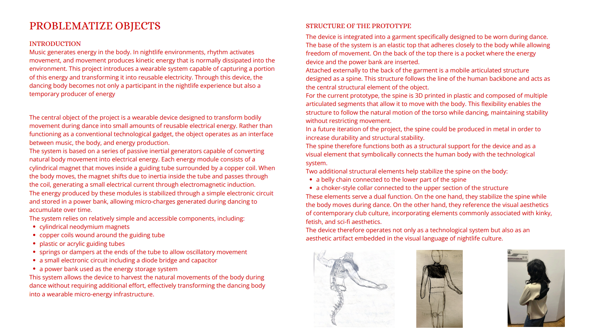
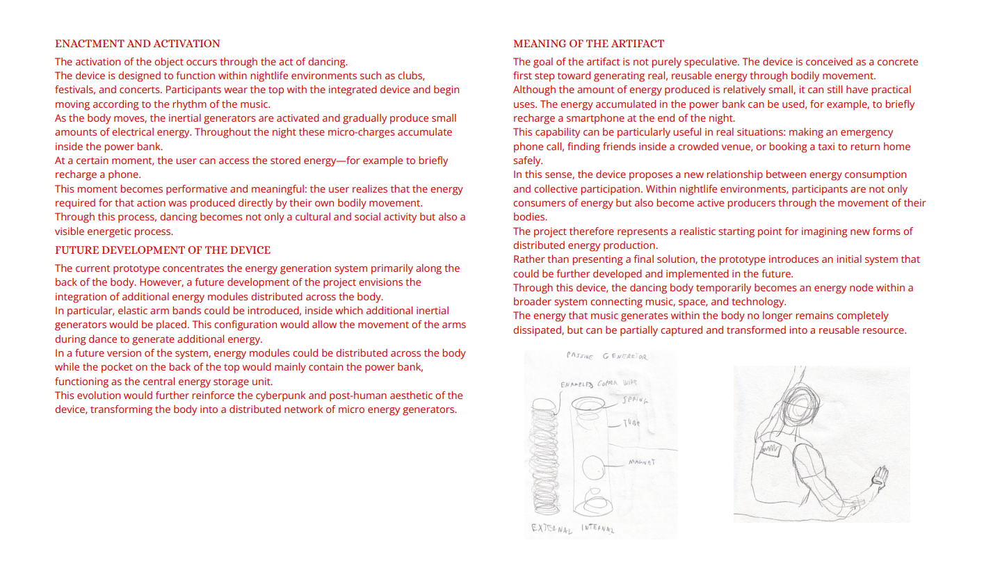

# problematize space
 
 
# problematize narratives

  <iframe
    src="https://www.youtube.com/embed/7XKQHD0nbFc"
    title="Francesco Mignogna - Sound to Energy"
    style="position: absolute; top: 0; left: 0; width: 100%; height: 100%;"
    frameborder="0"
    allow="accelerometer; autoplay; clipboard-write; encrypted-media; gyroscope; picture-in-picture; web-share"
    allowfullscreen>
  </iframe>

# problematize objects

    
    

    <button class="prev">&#10094;</button>
    <button class="next">&#10095;</button>

    
    

